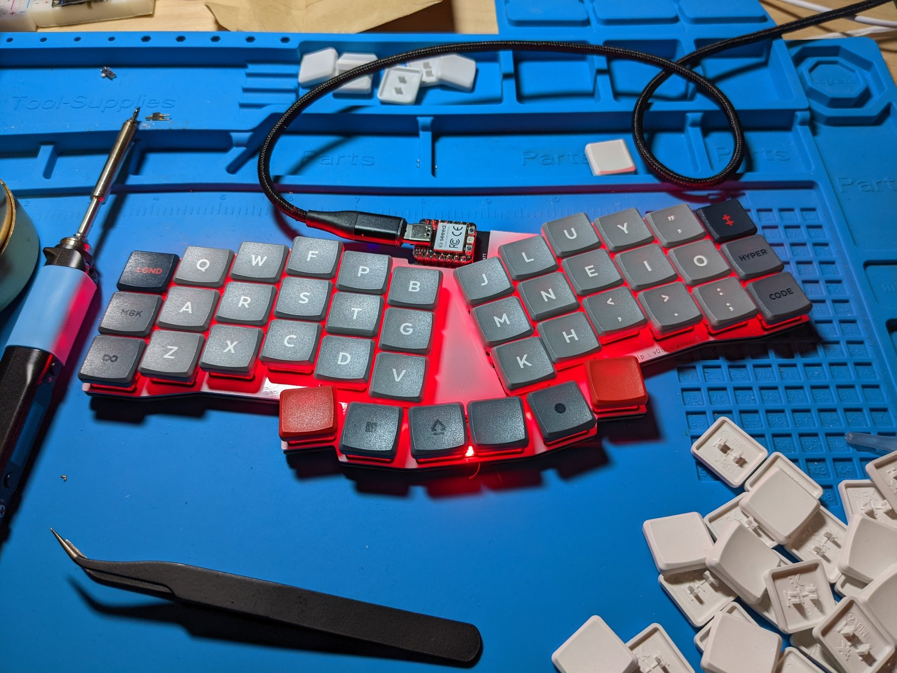
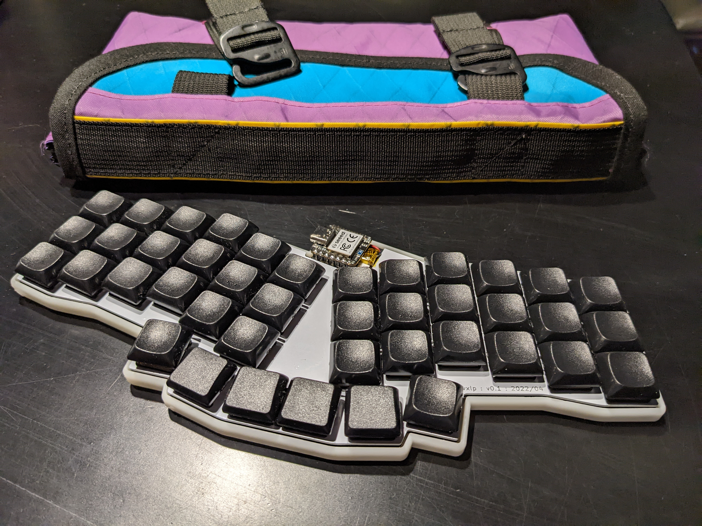

# revxlp Overview

The revxlp is a 41/42 key low profile (choc v1), unibody split, keyboard, supporting hotswap sockets, two thumb layouts, and single color backlight per-key LEDs. It is a remix of the amazing [revlp](https://github.com/cyril279/keyboards/tree/main/revlp) by Cyril, who created it off the original [reviung41](https://github.com/gtips/reviung/tree/master/reviung41) by gtips.

## Layouts

The revxlp PCB supports 41 or 42 key layouts, with either a single 2u middle thumb, or dual 1u thumb keys.

## Backlighting

Single color LED backlighting is supported. It does *NOT* support per-key RGB. If building yourself, choose the color PLL-2 LED you want to use, and calculate the desired resistor value based on the LED forward voltage and current.

A jumper on the back of the PCB needs to be jumped, depending on if you want to power the LEDs from the raw 5v from USB, or the regulated 3.3v power source. For a build using the XIAO BLE, you might want to consider, this carefully; bridging to the 5v source means the LEDs will automatically be cut from power when USB is unplugged. If using 3.3v, you will likely deplete the tiny LiPo battery quickly w/ LEDs on *anyways*.

### LED Resistance Calculator

To determine which value resistor to use, you can use a simple [LED Resistor Calculator](https://ohmslawcalculator.com/led-resistor-calculator).

To do so, you will need to find the following information from the datasheet for the LED you want to use:

* Voltage drop across the LED. This is often referred to as the "forward voltage", sometimes with a symbol of `Vf`.
* The typical/max forward current (in mA). Usually this is around 20-25mA, but it depends on the LEDs.
* The controller voltage you want to use, either 3.3v or 5v depending on what you've chosen.

Once you've entered in those values, the calculator should give you a resistor value in ohms. From there, search for resistors with that value *or lower* in a SMD 1206 package.

## Controllers

The revxlp is designed to use any controller designed to be Seeed Studio XIAO compatible. The two major families of controllers are the XIAO controllers from Seeed Studio, and the Adafruit Qt PY controllers.

The current list of controllers, and their support status is as follows:

| Controller                                                          | Chip     | Features             | Status                                                         |
| ------------------------------------------------------------------- | -------- | -------------------- | -------------------------------------------------------------- |
| XIAO                                                                | samd21   | USB                  | Supported                                                      |
| Adafruit Qt PY                                                      | samd21   | USB                  | Supported                                                      |
| XIAO BLE                                                            | nRF52840 | USB,BLE,LiPo Battery | Supported                                                      |
| XIAO RP2040                                                         | RP2040   | USB                  | [Experimental](https://github.com/zmkfirmware/zmk/issues/1085) |
| Adafruit Qt PY RP2040                                               | RP2040   | USB                  | [Experimental](https://github.com/zmkfirmware/zmk/issues/1085) |
| [01Space RP2040-0.42LCD](https://github.com/01Space/RP2040-0.42LCD) | RP2040   | USB                  | [Experimental](https://github.com/zmkfirmware/zmk/issues/1085) |
| XIAO ESP32-C3                                                       | ESP32-C3 | USB,BLE,LiPo Battery | Not Yet Supported                                              |
| Adafruit Qt PY ESP32-C3                                             | ESP32-C3 | USB,BLE,LiPo Battery | Not Yet Supported                                              |

The ESP32-C3 based controllers will likely be supported in the future, as Zephyr/ZMK support for
that chip is completed.

## Bill Of Materials (BOM)

The BOM for the revxlp is as follows:

| Description                        | Count                 | Footprint | Value/MPN                            | Sources                                                                                                                                                                                                                                                                                                                                                                                                                                                                      |
| ---------------------------------- | --------------------- | --------- | ------------------------------------ | ---------------------------------------------------------------------------------------------------------------------------------------------------------------------------------------------------------------------------------------------------------------------------------------------------------------------------------------------------------------------------------------------------------------------------------------------------------------------------- |
| XIAO Compatible Controller         | 1                     | XIAO      | e.g. XIAO BLE, XIAO, XIAO RP2040     | [Seeed Studio XIAO](https://www.seeedstudio.com/XIAO-c-1964.html)/[Adafruit Qt Py](https://www.adafruit.com/?q=qt+py&sort=BestMatch)                                                                                                                                                                                                                                                                                                                                         |
| Shift Register                     | 1                     | SOIC-16   | SN74HC595 (e.g. SN74HC595D* from TI) | [Octopart](https://octopart.com/search?q=SN74HC595&currency=USD&specs=0) - Note, avoid DW* packages, as those are *wide* SOIC-16.                                                                                                                                                                                                                                                                                                                                            |
| Controller Sockets                 | 2                     |           | Mill Max 310-43-107-41-001000        | [Octopart](https://octopart.com/search?q=310-43-107-41-001000&currency=USD&specs=0)                                                                                                                                                                                                                                                                                                                                                                                          |
| Reset/Battery Pogo Pins            | 2                     |           | Mill Max 0906-2-15-20-75-14-11-0     | [Octopart](https://octopart.com/search?q=0906-2-15-20-75-14-11-0&currency=USD&specs=0)                                                                                                                                                                                                                                                                                                                                                                                       |
| Kailh Choc Hotswap Sockets         | 43                    |           | CPG135001S30                         | [MKUltra](https://mkultra.click/kailh-hotswap-sockets)/[BoardSource](https://boardsource.xyz/store/5eca381464caf04f83aa6482)/[mb](https://mechboards.co.uk/products/kailh-choc-hotswap-sockets)                                                                                                                                                                                                                                                                              |
| 1N4148W Diodes         | 43                    |           | SOD-123                         |                                                                                                                                                                                                                                                                                                                                                                                                                                                                              |
| Kailh Choc v1 Switches             | 41/42                 | N/A       | PG1350                               |                                                                                                                                                                                                                                                                                                                                                                                                                                                                              |
| Keycaps (Kailh Choc v1 compatible) | 42x 1u/40x 1u + 1x 2u | N/A       | PG1350                               |                                                                                                                                                                                                                                                                                                                                                                                                                                                                              |
| Reset Button                       | 1                     |           | Panasonic EVQPUC02K                  | [Octopart](https://octopart.com/search?q=EVQPUC02K&currency=USD&specs=0)                                                                                                                                                                                                                                                                                                                                                                                                     |
| Bumpons                            | 7                     |           | SJ5382                               | [Octopart](https://octopart.com/search?q=SJ5382&currency=USD&specs=0)/[Mouser](https://www.mouser.com/ProductDetail/3M-Electronic-Specialty/SJ5382?qs=suIBlYRJoct4SYaT0QGOXQ%3D%3D)                                                                                                                                                                                                                                                                                          |
| Power Switch                       | 1                     |           | PCM12                                | [Octopart](https://octopart.com/search?autosugg_idx=0&oq=pcm12&q=pcm12smtr&currency=USD&specs=0)                                                                                                                                                                                                                                                                                                                                                                             |
| JST Socket                         | 1                     |           | SM02B-SRSS-TB(LF)(SN)                | [LCSC](https://lcsc.com/product-detail/Wire-To-Board-Wire-To-Wire-Connector_JST-Sales-America-SM02B-SRSS-TB-LF-SN_C160402.html)                                                                                                                                                                                                                                                                                                                                              |
| Battery                            | 1                     | 350820    | 40mAh                                | [Tiny Circuits](https://tinycircuits.com/collections/batteries/products/lithium-ion-polymer-battery-3-7v-40mah)                                                                                                                                                                                                                                                                                                                                                              |
| Backlight MOSFET                   | 1                     | SOT-23    | AO3416                               | [LCSC](https://lcsc.com/search?q=AO3416)                                                                                                                                                                                                                                                                                                                                                                                                                                     |
| Backlight MOSFET Resistor          | 1                     | 1206      | 4.7k Ω                               | [Mouser](https://www.mouser.com/c/passive-components/resistors/?case%20code%20-%20in=1206&resistance=4.7%20kOhms)/[Digikey](https://www.digikey.com/en/products/filter/chip-resistor-surface-mount/52?s=N4IgjCBcpgbFoDGUBmBDANgZwKYBoQB7KAbRAA4BmAdjAgF0CAHAFyhAGUWAnASwDsA5iAC%2BBAEwAGcgFYEIZJHTZ8RUiAAsAOmoACANYB5ABYBbLCEYhW7AKr9eLQygCyONFgCu3HKJEigA)/[LCSC](https://lcsc.com/product-detail/Chip-Resistor-Surface-Mount_Resistor-Today-PTFR1206B4K70N9_C2692712.html) |
| Backlight LEDS                     | 42                    | PLCC-2    | User selected color                  | [Mouser](https://www.mouser.com/c/optoelectronics/led-emitters/?package%20%2F%20case=PLCC-2)/[Digikey](https://www.digikey.com/en/products/filter/led-lighting-color/125?s=N4IgjCBcpgTAnBaIDGUBmBDANgZwKYA0IA9lANrgBsAHFXCALrEAOALlCAMpsBOAlgDsA5iAC%2BEoA)                                                                                                                                                                                                                  |
| Backlight Resistors                | 42                    | 1206      | See Backlighting calculator docs     | [Mouser](https://www.mouser.com/c/passive-components/resistors/smd-resistors-chip-resistors/?case%20code%20-%20in=1206)/[LCSC](https://www.lcsc.com/products/Chip-Resistor-Surface-Mount_439.html)                                                                                                                                                                                                                                                                           |
| Case Standoff Solder Nuts          | 7                     |           | M2 x 2mm Solder Nuts                 | [Mouser](https://www.mouser.com/ProductDetail/PEM/SMTSO-M2-2ET?qs=l4Gc20tDgJLQz0KP180tTQ%3D%3D)/[LCSC](https://www.lcsc.com/product-detail/Nuts_Sinhoo-SMTSO2020MTJ_C2916384.html)                                                                                                                                                                                                                                                                                           |
| Case Screws                        | 7                     |           | M2 x 6mm - Wafer Head                | [AliExpress Search](https://www.aliexpress.com/w/wholesale-m2-6mm-wafer-head.html?catId=0&initiative_id=SB_20221218103914&origin=y&SearchText=m2%2B6mm%2Bwafer%2Bhead&spm=a2g0o.detail.1000002.0&dida=y)/[AliExpress Validated Vendor](https://www.aliexpress.us/item/3256802107291989.html?spm=a2g0o.order_detail.order_detail_item.3.7f27f19cuFg60R&gatewayAdapt=glo2usa4itemAdapt&_randl_shipto=US)                                                                       |

# Production Files

The following files are available as open source hardware (OSH) for folks to produce. They are all released under the MIT license, like the originals they are based on.

If you get any of these made, and are financially able to, please consider sponsoring me using the "Open Source Hardware Love" one-time tier on my [GitHub Sponsorship Page](https://github.com/sponsors/petejohanson).

## PCB

revxlp PCBs can be made at any of the common services, e.g. [JLC](https://jlcpcb.com/), [AllPCB](https://www.allpcb.com/), etc.

When ordering, you'll want to use the following details:

* Width: 239mm
* Height: 95mm
* Thickness: 1.6mm

You'll need the following download:

* [revxlp PCB Gerbers](https://gitlab.com/lpgalaxy/revxlp/-/jobs/artifacts/main/raw/pcb/JLCPCB/revxlp-JLCPCB.zip?job=export-pcb)

### PCB Assembly (PCBA)

If ordering from JLC, you can also have JLC assemble a large part of the build for you, simplifying sourcing much of the BOM. It also avoids needing to hand solder the shift register, which has a 1.3mm pitch between pins; this may be useful if you are not experienced with soldering smaller components, or with drag soldering as a technique. If you choose to use PCBA, you will still need to solder:

* Switch hotswap sockets
* Controller sockets/pins
* JST socket (optional, for wireless builds only)
* Solo pogo pins (optional, required for wireless builds)
* Backlight LEDs (optional)

When ordering, select "Standard PCBA", Bottom side, and when prompted, upload the BOM and pick and place files. The only thing you may need to change for the part selection is the resistors for the backlight LEDs, if you plan to solder your own LEDs after PCBA'ing the rest of the board.

You'll need the following downloads:

* [revxlp BOM](https://gitlab.com/lpgalaxy/revxlp/-/jobs/artifacts/main/raw/pcb/revxlp_bom_jlc.csv?job=export-pcb)
* [revxlp pick & place](https://gitlab.com/lpgalaxy/revxlp/-/jobs/artifacts/main/raw/pcb/revxlp_cpl_jlc.csv?job=export-pcb)

## Switch Plate

The switch plate is exported two ways, one to be used for for JLC's Aluminum PCBs, which are single sided silk, and the other for standard FR4 plates. When ordering either, be sure to use the following details:

* Width: 239mm
* Height: 95mm
* Thickness: 1.2mm

You can download either

* [Aluminum Switch Plate Gerbers](https://gitlab.com/lpgalaxy/revxlp/-/jobs/artifacts/main/raw/plate/JLCPCB/revxlp_plate-JLCPCB_Alu.zip?job=export-switch-plate)
* [FR4 Switch Plate Gerbers](https://gitlab.com/lpgalaxy/revxlp/-/jobs/artifacts/main/raw/plate/JLCPCB/revxlp_plate-JLCPCB_FR4.zip?job=export-switch-plate)

## Bottom Plate

The bottom plate can also be ordered in Aluminum or FR4. When ordering, use the following details:

* Width: 239mm
* Height: 95mm
* Thickness: 1.2mm

You can download either

* [Aluminum Switch Plate Gerbers](https://gitlab.com/lpgalaxy/revxlp/-/jobs/artifacts/main/raw/bottom/JLCPCB/revxlp_bottom-JLCPCB_Alu.zip?job=export-bottom-plate)
* [FR4 Switch Plate Gerbers](https://gitlab.com/lpgalaxy/revxlp/-/jobs/artifacts/main/raw/bottom/JLCPCB/revxlp_bottom-JLCPCB_FR4.zip?job=export-bottom-plate)

## 3DP Bottom Case

The 3DP bottom case is designed to work with the switch plate, and has a few optional features you can choose to include for the generate case:

* Button cutouts - Cutouts are added along the top edge to access the power switch and reset buttons. If you don't need either, build the `logo` or `none` variants.
* Logo - The Low Pro Galaxy, LLC logo is added as an inset on the bottom of the case. This should only be used if printing with something like resin. To skip the logo, use the `button_cutout` or `none` variants.
 
Cases can be printed yourself, or ordered through an online service, including JLC if also getting PCBs/plates ordered. They are generated using CadQuery, and are available as STEP or STL files.

* `all` variant, includes logo and button cutouts: [STEP](https://gitlab.com/lpgalaxy/revxlp/-/jobs/artifacts/main/raw/revxlp_case_all.step?job=generate-3dp-case)/[STL](https://gitlab.com/lpgalaxy/revxlp/-/jobs/artifacts/main/raw/revxlp_case_all.stl?job=generate-3dp-case)
* `logo` variant, includes logo, but *NO* button cutouts: [STEP](https://gitlab.com/lpgalaxy/revxlp/-/jobs/artifacts/main/raw/revxlp_case_logo.step?job=generate-3dp-case)/[STL](https://gitlab.com/lpgalaxy/revxlp/-/jobs/artifacts/main/raw/revxlp_case_logo.stl?job=generate-3dp-case)
* `button_cutouts` variant, includes button cutouts, but *NO* logo: [STEP](https://gitlab.com/lpgalaxy/revxlp/-/jobs/artifacts/main/raw/revxlp_case_button_cutouts.step?job=generate-3dp-case)/[STL](https://gitlab.com/lpgalaxy/revxlp/-/jobs/artifacts/main/raw/revxlp_case_button_cutouts.stl?job=generate-3dp-case)
* `base` variant, *NO* button cutouts, nor logo: [STEP](https://gitlab.com/lpgalaxy/revxlp/-/jobs/artifacts/main/raw/revxlp_case_base.step?job=generate-3dp-case)/[STL](https://gitlab.com/lpgalaxy/revxlp/-/jobs/artifacts/main/raw/revxlp_case_base.stl?job=generate-3dp-case)

# Build Guide

Assembly of revxlp is a medium difficulty tasks. It is simplified if you've had the PCBs assembled by your manufacturer, but that still leaves a few steps that are slightly above basic soldering level.

The following table breaks down the necessary build steps, based on the kind of build you're doing:

| Item                        | Bare PCB     | PCBA | Case |
| --------------------------- | ------------ | ---- | ---- |
| Diodes                      | ✓            | 🗙    |      |
| Shift Register              | ✓            | 🗙    |      |
| Resistors and LEDs          | ✓            | 🗙/✓  |      |
| Reset Button                | ✓            | 🗙    |      |
| Power Switch                | ✓ (Wireless) | 🗙    |      |
| Solder Nuts                 |              | 🗙    | ✓    |
| Controller Sockets/Pins     | ✓            | ✓    |      |
| Pogo Pins                   | ✓            | ✓    |      |
| Battery Socket              | ✓ (Wireless) | ✓    |      |
| Install To Case/Add Bumpons |              |      | ✓    |

If you've not previously done any soldering, Adafruit has a great [guide to excellent soldering](https://learn.adafruit.com/adafruit-guide-excellent-soldering/tools) that is worth reviewing.

## Tools Needed

1. Soldering Iron
2. Quality Solder
3. Flux (important for easy soldering of the shift register, even with leaded solder)
4. Solder wick (maybe needed to clean up the shift register if too much solder is used.)
5. Kapton or scotch tape
6. Tweezers (ideally ESD tweezers)
7. Screw Driver
8. Multimeter (recommended to check for shorts for a few smaller components)

## Build Steps

Skip any of the following steps if they do not apply to your build.
### Diodes

The SMD diodes should be installed first. The diodes are all located on the back of the PCB and are all marked with a `D_` prefix. The steps are as follows.

1. Tin/apply solder to *one* pad of the diode footprint.
2. Align the diode on the footprint, with the line/marker on the side of the footprint that has white silk/print around the pad.
3. Holding the diode in place with your tweezers, reflow the solder already on the pad to flow it and connect to the diode leg.
4. Double check the alignment of the diode, ensuring the *other* diode leg is properly positioned over the other pad, and is flush with the surface of the PCB. If not, go back to step #3.
5. Apply heat to the other diode leg and pad, add remove the solder and tip.
6. Repeat for all the other diodes. It can speed things up to batch this process, first tinning one pad of every diode footprint, then reflowing to attach the first leg of all the diodes, then adding solder to the other pad for all of them.

### Shift Register

The shift register is the hardest component to solder. It is recommended to use a technique called "drag soldering" to do so. Here is a good [intro video](https://www.youtube.com/watch?v=MR_UZtcqoFo) of the technique. A knife edge soldering iron tip can make the technique easier.

1. Identify pin 1 of the shift register component. It may be clearly indicated with a dot, or simply have all the markings on that end of the component.
2. Tin pad 1 of the shift register footprint.
3. Carefully align the shift register on the footprint, with pin 1 of the component over the pad indicated by the dot on the PCB.
4. Reflow the solder on pad 1, being careful not to shift the shift register when doing so.
5. Verify the alignment of all the pins over the pads. This is *very* important to do before soldering any more pins. If not aligned well, be sure to always reflow the soldered pin while repositioning, to avoid tearing the pad off the PCB.
6. Once aligned, apply flux to one row of pins on the component.
7. Apply a *small* amount of solder to the tip of your iron, and carefully drag it across the line of pins, contacting both the pins and the solder pads of the PCB. Small even amounts of solder should be left connecting each pin to the PCB.
8. Check for any bridges between adjacent pins, or pins without solder on them. If necessary, reflow/drag again. You may need to use more flux, or if *way* too much solder, use some solder wick to remove the excess.
9. Take a deep breath, and celebrate your success.

### Backlight Resistors and LEDs

Use the same technique used to solder the diodes to solder the resistors to all the footprints with a `R_` prefix on the bottom of the PCB, and then again for the LEDs to each footprint on the top of the PCB for each switch.

### Backlight MOSFET and pull-down resistor

`Q1` and `R80` are the two control components for the backlight hardware. First, solder the `Q1` mosfet with the same general technique:

1. Tin one pad of the `Q1` footprint with solder.
1. Carefully place the SOT-23 component in place, then reflow the tinned pad to secure it. Be sure to check the alignment of the other two legs, and reflow/adjust the placement as needed before soldering the rest.
1. Once properly aligned, apply solder to the other two legs of the MOSFET.

Repeat the same procedure with the bias resistor `R80` next to `Q1`.

### Switch Sockets

Use the same sequence to solder the switch sockets.

### Reset Button

The reset button follows similarly:

1. Tin one pad of the reset button footprint.
2. Place the reset button in place.
3. Reflow the existing solder, and ensure the button is aligned properly and fully inserted.
4. Apply solder to the remaining legs of the button.

### Power Switch

The power switch can be installed with the same approach:

1. Tin one pad of the power switch footprint.
2. Place the switch in place.
3. Reflow the existing solder, and ensure the switch is aligned properly and fully inserted.
4. Apply solder to the remaining legs of the switch.

### Solder Nuts (Case Builds Only)

If using a case or bottom plate, the solder nuts need to be installed. Due to their large thermal mass, these take more time to solder. When soldering, be careful not to get any solder into the interior threaded portion of the nut.

1. Apply a medium solder to the ring of the footprint. You want enough to flow and hold the nut in place, but not so much it risks flooding into the nut.
2. Place the solder nut int the hole, from the bottom of the PCB.
3. Applying gentle pressure to push the solder nut fully into place with your tweezers, apply heat to the nut and PCB pad, waiting long enough for the nut to heat enough to reflow and bond to the solder.
4. Repeat for all the solder nuts.

### Controller Sockets and Pins

Do *not* use standard headers that come with many controllers, unless you are doing a USB only build without the reset button. They will *not* allow you to remove the controller and install the pogo pins or battery.

1. Place the two socket strips into the PCB from the top.
2. Apply a strip of kapton/scotch tape to each strip, ensuring every socket hole is fully covered.
3. Using tweezers, and possibly the flat side of your screwdriver to push them in, place a pin in the four corner holes of the controller, pushing them *through* the tape and into the socket. Once through the tape, give them an *extra* push to be sure they are *fully* seated in the socket. The top of the pin should only stick out above the surface of the controller by 1mm or less.
4. Carefully holding the controller/sockets in place with gentle pressure from above, solder the four pins to the controller. This will halp stabilize the sockets for soldering them next.
5. Flip over the PCB, and gently holding the PCB down onto the controller to keep things aligned, solder the pin on each end of each strip, to get them held in place.
6. Solder the remaining pins of the strips from the bottom
7. Flip the PCB back over, and insert the remaining pins fully into the sockets through the controller and tape, then solder them all.
8. Gently pry the controller off the sockets, to remove the tape. If using the pogo pins for battery connection and/or reset button, set the controller aside

### Pogo Pins

Two pogo pins are used to connect the reset button and battery to the controller. The holes for these pogo pins will be located between the two controller socket strips you just soldered.

1. Apply solder to each hole, so the solder just barely forms a bulge in the hole.
2. For each pogo pin, hold the pin carefully in your tweezers, and apply heat to the solder in the hole with the other hand. Once the solder is flowing, carefully insert the pin into the hot solder. 
3. Check the alignment of the pin. 
4. Reflow the solder by holding your iron tip on the base of the pin while adjusting the pin angle with your tweezers. The pins should be pointed straight up when viewed from both sides.

### Battery Socket

The JST socket can be installed if you've purchased a compatible battery with a JST SH connector. Be sure to check the polarity of the battery to be sure it matches! If not, simply snip the connector of your battery and use the battery pads on the PCB instead.

1. Tin both of the mounting pads of the footprint, located closer to the top edge of the PCB.
2. Carefully position the JST socket, so the pins add the back of the socket align with the untinned pads on the PCB.
3. Reflow *one* of the tinned pads to connect the socket.
4. Double check your alignment, reflowing to reposition if needed.
5. Once positioned well, reflow the other pad to connect the other corner fo the socket.
6. Apply a small amount of flux to the two unsoldered pins at the back of the socket.
7. Solder both pins to the PCB. Only a small amount of solder is needed.
8. Check for shorts between the two pins. This is *very* important to do before inserting a battery plug.
9. Insert the plug of the battery carefully into the socket. Be sure not to push too hard, and support the back of the socket while doing so.

#### Bare Wire Battery

If not using a battery with a JST plug, then.

1. Tin both bare battery pads.
2. Solder the wires one at a time to the pads. Be sure the polarity is correct, black wire to the "-" pad, red wire to the + pad.

### Reinstall the controller

Now, you can carefully reinstall the controller with the attached pins back into the socket. If using a battery, be sure it is placed properly, and it next to, not over, either pogo pin.

### Switches

Next, install all the switches

Whenever installing switches into hotswap sockets, *always* support the socket from below with a finger. This will help prevent a torn socket pad in the case where a switch leg is not properly aligned during insertion!

1. Place a switch in the top and bottom outer corners of the switch plate.
2. Align the plate over the PCB.
3. Carefully insert each switch in the sockets one at a time, supporting them from below.
4. With the switch plate in place, repeat the process with the remaining switches. If using a single 2u thumb in the bottom row, place just one switch, rotated 180 degrees, into the middle socket.

### Case/Plate

Now that everything is fully assembled, it's time to install the case/bottom plate.

#### Case

1. Insert the top edge of the PCB first, making sure to align the reset and power switches with the matching cutouts along the top edge of the case.
2. Slowly rotate in the bottom edge of the PCB, so the PCB and switch plate sit fully in the case.
3. Carefully torn over the combined assembly.
4. Insert and gently tighten the M2 screws through the case into the solder nuts of the PCB
5. Add the bumpons to the bumpon inset spots on the bottom of the case.

#### Basic Bottom Plate

1. Torn over the PCB & switch plate assembly.
2. Align the bottom plate over the solder nuts.
3. Insert and gently tighten the M2 screws through the bottom plate into the solder nuts of the PCB
## Firmware

Latest firmware can be found at https://github.com/petejohanson/revxlp-config
